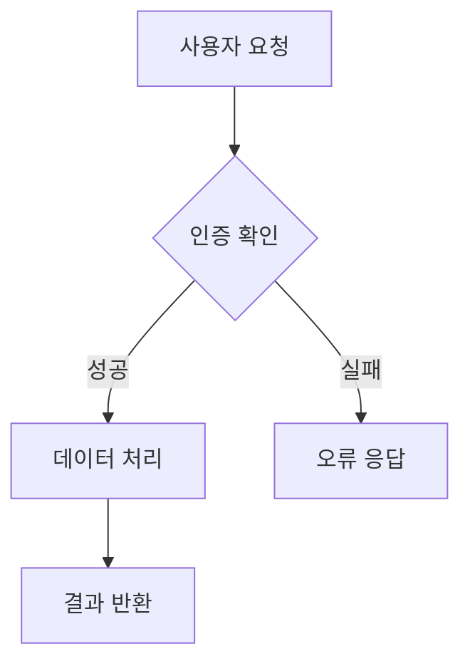

# Korean Text in Visualizations

## SVG Korean Text

### Font-Family Fallback Chain

Always specify a fallback chain for Korean text in SVG:

```xml
<text font-family="'Noto Sans KR', 'Apple SD Gothic Neo', 'NanumGothic', 'Malgun Gothic', sans-serif"
      font-size="14" fill="currentColor">
  한국어 텍스트
</text>
```

### Platform-Specific Font Availability

| Font | macOS | Linux | Windows | Web (CDN) |
|------|-------|-------|---------|-----------|
| Noto Sans KR | Install | `fonts-noto-cjk` | Install | Google Fonts |
| Apple SD Gothic Neo | Built-in | — | — | — |
| NanumGothic | Install | `fonts-nanum` | Install | Google Fonts |
| Malgun Gothic | — | — | Built-in | — |

### Web Font Loading (for HTML visualizations)

```html
<link href="https://fonts.googleapis.com/css2?family=Noto+Sans+KR:wght@400;700&display=swap" rel="stylesheet">
```

Or via CSS:
```css
@import url('https://fonts.googleapis.com/css2?family=Noto+Sans+KR:wght@400;700&display=swap');
```

### SVG Text Rendering Best Practices

1. **Always set `font-family` with fallback chain** — never rely on a single font name
2. **Use `dominant-baseline="central"`** for vertical centering of Korean text in boxes
3. **Increase line height** for Korean text: `dy="1.4em"` vs `dy="1.2em"` for Latin
4. **Test with `view_image`** after rendering — Korean characters can silently fall back to
   a different font with mismatched metrics

### Mixed Korean/English Text

```xml
<!-- Use tspan for mixed-language segments when metrics differ -->
<text font-family="'Noto Sans KR', sans-serif" font-size="14">
  <tspan>서버 상태: </tspan>
  <tspan font-family="'SF Mono', 'Consolas', monospace">200 OK</tspan>
</text>
```

## HTML / D3.js Visualizations with Korean

### Chart.js Korean Labels

```javascript
Chart.defaults.font.family = "'Noto Sans KR', 'Apple SD Gothic Neo', sans-serif";

new Chart(ctx, {
  type: 'bar',
  data: {
    labels: ['매출', '비용', '이익', '투자', '부채'],
    datasets: [{
      label: '2026년 재무 현황 (억원)',
      data: [120, 80, 40, 30, 25],
    }]
  },
  options: {
    plugins: {
      title: { display: true, text: '분기별 재무 보고서' }
    }
  }
});
```

### D3.js Korean Axis Labels

```javascript
const svg = d3.select('#chart').append('svg');

// Korean-safe axis
const xAxis = d3.axisBottom(xScale)
  .tickFormat(d => d);  // Korean labels pass through directly

svg.append('g')
  .call(xAxis)
  .selectAll('text')
  .style('font-family', "'Noto Sans KR', sans-serif")
  .style('font-size', '12px');
```

### Codex Visualize Skill Integration

When creating inline HTML visualizations for Codex (using the `visualize` skill contract):

1. **Load Korean web font** from the allowed CDN list:
   ```html
   <link href="https://fonts.googleapis.com/css2?family=Noto+Sans+KR:wght@400;700&display=swap" rel="stylesheet">
   ```

2. **Set font on the fragment root**:
   ```css
   #viz-root {
     font-family: 'Noto Sans KR', var(--font-family, sans-serif);
   }
   ```

3. **Follow the visualize skill's color variables** (`--foreground`, `--card`, etc.)
   for theme compatibility

4. **Keep the fragment under 1 MB** — aggregate Korean text data instead of inlining
   full datasets

### Visual Verification

After generating any visualization with Korean text:

1. Render to image (screenshot or `view_image`)
2. Check for:
   - Tofu boxes (missing font fallback)
   - Text overflow (Korean characters wider than Latin)
   - Axis label clipping (Korean labels need more width)
   - Line break issues (CJK word wrapping differs from Latin)
3. If using web fonts, verify the font loaded (check for font swap flash)

## PDF-Embedded Diagrams

To embed a visualization in a PDF (cross-reference with `jaw-pdf`):

1. Generate the SVG/HTML visualization
2. Export as PNG at high resolution (200+ DPI):
   ```python
   # For SVG: use cairosvg
   import cairosvg
   cairosvg.svg2png(url='diagram.svg', write_to='diagram.png', dpi=200)

   # For HTML: use a headless browser screenshot
   # agbrowse fetch "file:///path/to/viz.html" --screenshot /tmp/viz.png
   ```
3. Embed in reportlab PDF:
   ```python
   from reportlab.platypus import Image
   from reportlab.lib.units import cm
   img = Image('diagram.png', width=16*cm, height=10*cm)
   story.append(img)
   ```

## Mermaid Korean Text

Mermaid supports Korean text natively in most diagram types:



Known issue: very long Korean labels in Mermaid can overflow node boxes.
Keep labels under 15 characters or use line breaks with `<br/>`.
